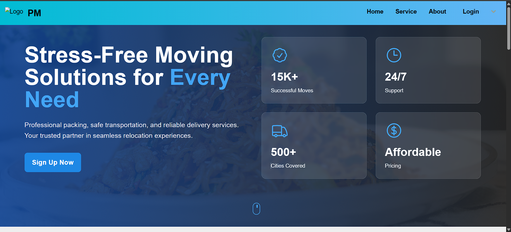

# 🚛 Packers and Movers Platform

A full-stack **Packers and Movers** web application that connects customers with verified service providers for seamless relocation experiences. Built using **React (Tailwind CSS)** on the frontend and **Spring Boot** on the backend.

---

## 🚀 Features

- 🧍 Customer and 📦 Service Provider dashboards
- 🔐 User registration with **email OTP verification**
- 📄 Quotation management system
- 💬 Feedback and ratings system
- 💰 Partial payment at booking, final payment after service
- 📱 Mobile-responsive UI

---

## 🖼️ Screenshots

###  HomePage Form

###  Booking Form

### 📋 Customer Dashboard

### 📦 Provider Dashboard

### 📦 Admin Dashboard

### 🧾 Quotation Request

---

## 🧠 System Architecture

- **Three-tier architecture:**
  - 📱 **Presentation Layer** – React + Tailwind CSS
  - ⚙️ **Business Layer** – Spring Boot Services
  - 🗃 **Data Layer** – JPA/Hibernate with MySQL

---

## 🛠 Tech Stack

### Frontend
- React
- Tailwind CSS
- Axios
- React Router

### Backend
- Java 17+
- Spring Boot
- Spring MVC
- Spring Data JPA
- JavaMail 
- MySQL

---

